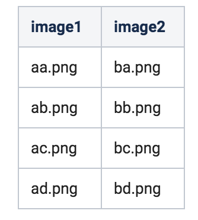
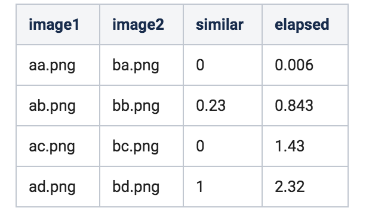

#Loblaws Image Similarity Tool
##This document is to review the tool to see how similar two images are.

###Installation 
This project requires three things

  1) Python3  
  2) virtualenv  
  3) pip  

To download python3 you can use the link [here](https://www.python.org/downloads/).  

####Windows
If you are on windows, then you can still get python3 from the link above.
Once you have python follow the instructions [here](https://pip.readthedocs.io/en/stable/installing/#do-i-need-to-install-pip) to download pip onto your machine.  

Once pip is installed, you can install virtualenv with 

```pip install virtualenv```

Then, ```cd``` into this directory and create the virtual environment wiht the command 

```virtualenv imageSim```

Now we can activate the virtual image with

```\imageSim\Scripts\activate.bat```

Now to grab all the requirements, type the command

```pip install -r requirements.txt```

####Mac
If you are on Mac you can also use homebrew to obtain all the libraries that you need first [here](https://brew.sh/)  
Using brew install python3 with the command  

```brew install python@3```  

To install virtualenv, use the command

```pip3 install virtualenv```

Then, ```cd``` into this directory and create the virtual environment wiht the command 

```virtualenv imageSim```

Now we can activate the virtual image with

```source imageSim/bin/activate ```

Now to grab all the requirements, type the command

```pip install -r requirements.txt```


###Usage
To use the tool, there are two files that you need  
1. First you need the csv file that has the image pairs full path  
2. A name for the destiniation csv full path  

Once you have those then use the command  
```python generateSimilarity.py --csvfile /path/to/csv --outcsvFile /path/to/output/csv```

The results will be stored in the output csv specified in the command

###Implementation Details
This program is split into two main parts  
1. ```genereateSimularity.py```: This file is the driver code in which it would read a csv, compute the differences then output a csv with the details of the csv explained below  
2. ```scoreModel.py```: This file is where you calculate the simularity of the two images ine question  

  * Currently only one model is used for speed purposes.  What is implemented is a comparison of the two image by first computing their colour histogram for each channel.  Then taking computing the distance using the chi squared measure giving a result.  The result should be 0 if they are the same and 1 if they are very different with values closer to 0 meaing they are similar.

One can extend this my adding more classes to the ```scoreModel.py``` namely using SSIM or feature extraction

To extend the ```scoreModel.py``` all that is required is to create a class extending ```similarityModel``` and implementing a ```computeScore()``` function that returns a the result of the calculation.

###CSV Details
This tool has the assumptions on the csvinput in which there are two complete path file names which represent the two image paths separated with a comma as shown

  

with the output csv in the folloiwng for  


